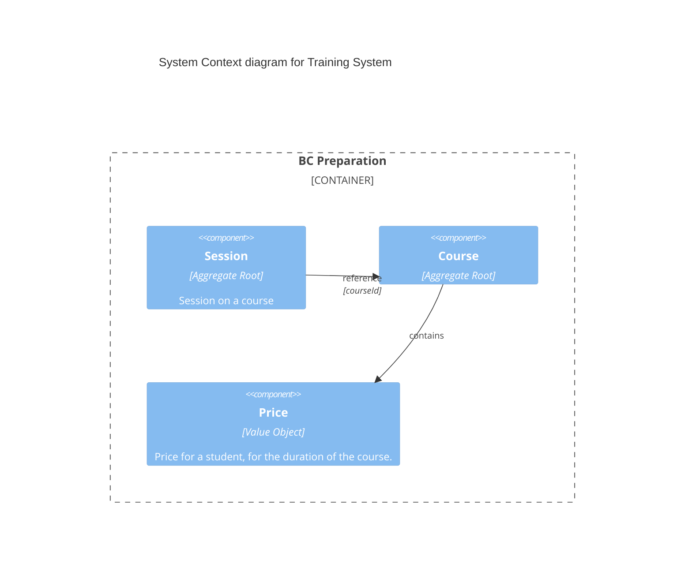

```mermaid
C4Context
      title System Context diagram for Training System
      Container_Boundary(preparation, "BC Preparation") {

          Component(session, "Session", "Aggregate Root", "Session on a course")
          Component(course, "Course", "Aggregate Root", "")
          Component(price, "Price", "Value Object", "Price for a student, for the duration of the course.")

          Rel(session, course, "reference", "courseId")
          Rel(course, price, "contains", "")

      }

```